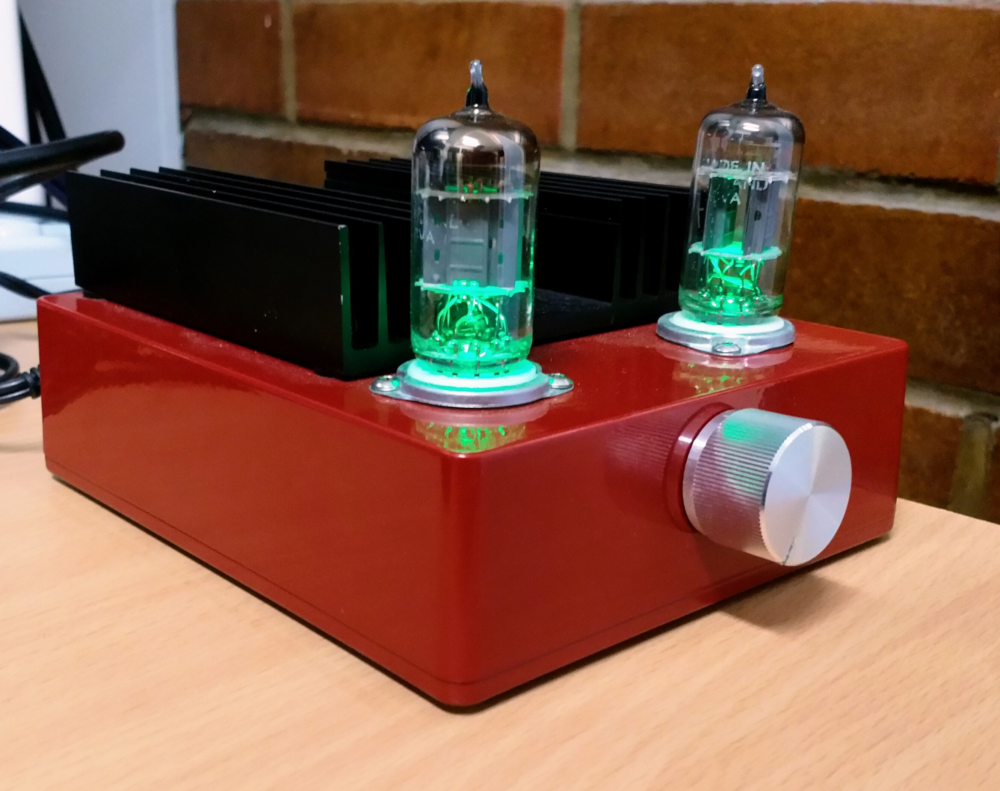

# Starving Student Millet Hybrid valve/tube headphone amplifier

## What?

A budget focussed DIY valve/tube headphone amplifier that is so simple it can be easily wired without a PCB.
This repository contains circuit schematics/diagrams for a variety of compatible valves/tubes.

## Why?

There is an amazing array of information out there on the Peter Millet designed [Starving Student Hybrid headphone amplifier][pm-ssmh] and various community modifications.
This project is an attempt to make it more easily accessible rather than requiring someone to delve into a forum thread many hundreds of pages deep.

I have drafted schematics for the circuits based around the following valves:

| Tube/Valve |  Case | Schematics                                                                                                                                   | Valve datasheets                                                                                  |
|:----------:|:-----:|----------------------------------------------------------------------------------------------------------------------------------------------|---------------------------------------------------------------------------------------------------|
| 12AU7      | glass | [PNG](./Exported%20schematics/SSMH_12A_7.png) · [PDF](./Exported%20schematics/SSMH_12A_7.pdf) · [KiCad](./KiCad%20schematics/SSMH_12A_7.pro) | [Brimar](./Datasheets/12AU7%20-%20Brimar.pdf) · [Tung-Sol](./Datasheets/12AU7%20-%20Tung-Sol.pdf) |
| 12AX7      | glass | [PNG](./Exported%20schematics/SSMH_12A_7.png) · [PDF](./Exported%20schematics/SSMH_12A_7.pdf) · [KiCad](./KiCad%20schematics/SSMH_12A_7.pro) | [Brimar](./Datasheets/12AX7%20-%20Brimar.pdf) · [Tung-Sol](./Datasheets/12AX7%20-%20Tung-Sol.pdf) |
| 12SR7      | metal | [PNG](./Exported%20schematics/SSMH_12S_7.png) · [PDF](./Exported%20schematics/SSMH_12S_7.pdf) · [KiCad](./KiCad%20schematics/SSMH_12S_7.pro) | [General Electric](./Datasheets/12SR7%20-%20General%20Electric.pdf)                               |
| 12SR7GT    | glass | [PNG](./Exported%20schematics/SSMH_12S_7.png) · [PDF](./Exported%20schematics/SSMH_12S_7.pdf) · [KiCad](./KiCad%20schematics/SSMH_12S_7.pro) | [Tung-Sol](./Datasheets/12SR7GT%20-%20Tung-Sol.pdf)                                               |
| 12SW7      | metal | [PNG](./Exported%20schematics/SSMH_12S_7.png) · [PDF](./Exported%20schematics/SSMH_12S_7.pdf) · [KiCad](./KiCad%20schematics/SSMH_12S_7.pro) | [RCA](./Datasheets/12SW7%20-%20RCA.pdf) · [Tung-Sol](./Datasheets/12SW7%20-%20Tung-Sol.pdf)       |
| 17EW8      | glass | [PNG](./Exported%20schematics/SSMH_17EW8.png) · [PDF](./Exported%20schematics/SSMH_17EW8.pdf) · [KiCad](./KiCad%20schematics/SSMH_17EW8.pro) | [RCA](./Datasheets/17EW8%20-%20RCA.pdf) · [Rogers](./Datasheets/17EW8%20-%20Rogers.pdf)           |
| 19J6       | glass | [PNG](./Exported%20schematics/SSMH_19J6.png) · [PDF](./Exported%20schematics/SSMH_19J6.pdf) · [KiCad](./KiCad%20schematics/SSMH_19J6.pro)    | [RCA](./Datasheets/19J6%20-%20RCA.pdf) · [Tung-Sol](./Datasheets/19J6%20-%20Tung-Sol.pdf)         |

Some of the valves share the same pin-outs, but others do not - where they do they've been shown in the same schematic.

So, for example the 12AX7 and 12AU7 have the same pin-out and power requirements so they are both included in `./KiCad schematics/SSMH_12A_7.pro`.
The same goes for the 12S_7 variants too.

[pm-ssmh]: http://pmillett.com/starving.htm

## KiCad

The diagrams were created using the open source schematic editor, [KiCad][kicad].
Whilst it can be a little complicated to learn (it doesn't take too long) it is a powerful circuit designer.

To open the project start with the `SSMH.pro` file as it should open the project and all sub-projects in KiCad - see `./KiCad schematics`.

You are then free to edit the schematic to add components or adjust values against existing components.

[kicad]: https://kicad-pcb.org/

### Handy tips

Here are a couple of handy little tips that I wish I had known when I was getting familiar with KiCad.

* <kbd>Command</kbd> + <kbd>Scrollwheel</kbd> pans the schematic horizontally (left/right)
* <kbd>Shift</kbd> + <kbd>Scrollwheel</kbd> pans the schematic vertically (up/down)

### Additional symbol/component libraries

The inbuilt valve libraries were not comprehensive enough so I made two additional symbols and used some from lib_w_vacuum.

* 19J6 by Simon Holywell (me)
* 12SR7 by Simon Holywell (me)
* lib_w_vacuum from http://smisioto.no-ip.org/elettronica/kicad/kicad-en.htm (please see included licence file)